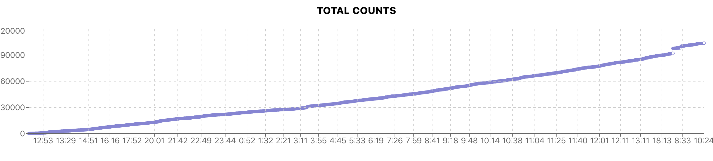

We have successfully integrated the CFF API in several different use cases:

* 2020 - [Sanjeevan Hanuman Chanting](https://sanjeevan-hanuman-followers.chinmayamission.com/) - used the CFF API to get the total number of times the Hanuman Chalisa was chanted, then created a graph and visualization to track this in real time.

* 2020 - [Ramdoot Brick Sponsorship](https://forms.chinmayamission.com/v2/forms/5ea8ad2b86ce4600016db83b/) - used the CFF API to get the number of sponsored bricks real-time, then fill out a graphic based on that.
