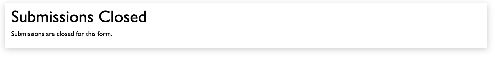

To close submissions, set the following values in formOptions to false: (both these attributes default to `true`):

```json
{
  "responseSubmissionEnabled": false,
  "responseModificationEnabled": false
}
```

The user will then, upon viewing the form, see a message like this:

