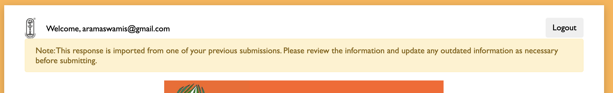

The form predicates feature allows you to import data from responses in another form. Use cases for this feature include:

- CMA Marietta used CFF for 2018 Balavihar Registration, and wants to do the same for 2019 Balavihar Registration. However, they would like for existing users' data to be imported, and for the grades to be bumped up one level.

- Sometimes some users might have made automatic "recurring payments" (such as Parivar) in the past through a previous form, which should automatically give them credit for the current year so they don't have to pay for it.

CFF supports a limited version of this through `formOptions.predicate` property.

## Simple usage
Just add the following to `formOptions`:

```json
{
    "predicate": {
        "formId": "abcd"
    }
}
```

The `formId` is the ID of the "predicate form", the form from which data needs to be imported. By default, the response that is owned by the current user from the predicate form is loaded; so this feature is currently only supported for forms that have `loginRequired` to true.

!!! note
    Only responses that have status equal to `PAID` will be imported from a predicate; if the user has an unpaid response in the predicate form, it will not be imported.

You will also need to add the following to the predicate form's `formOptions`:

```json
"successor": {
    "formId": "[form id of the current from]"
}
```

This is required as a security precuation, so that any form cannot claim an arbitrary form as a "predicate" and thus access its data.

## Customizing warning text
By default, when a new response is created with a predicate, the following warning shows up at the top of the page:



To customize this text, edit the `predicate.warningText` property.

```json
"predicate": {
    "warningText": "<b>Warning:</b> you are submitting a form based on old information from a predicate form."
}
```

## Applying patches
Sometimes you may want to modify the data to apply patches, such as promoting children up a grade. This is how you do so:

```json
{
    "predicate": {
        "formId": "abcd",
        "patches": [{"unwind": "/participants", "type": "walk", "items": ["A","B","C"], "path": "/grade"}]
    }
}
```

`predicate.patches` - A list of patches to apply to the response. All the patches get sequentially applied to the form data.

Above is an example of a "walk" patch, which will transform each "grade" and walk it up by 1 (A -> B, B -> C, otherwise will stay the same). The "unwind" parameter applies this patch to every element in the `participants` array.

### Other examples of patches

Sets the value at the `returning_family` path to `true`.
```json
{
    "type": "patch",
    "value": [
        { "op": "add", "path": "/returning_family", "value": true }
    ]
}
```

Removes the `grade` property for all objects in the array `children`.
```json
{
    "type": "patch",
    "unwind": "/children",
    "value": [
        { "op": "remove", "path": "/grade" }
    ]
}
```

<!--
This is still an idea, not an actual feature yet.

## Propagating paid status for recurring payments
In this use case, imagine that people signed up for Balavihar in 2019 and did recurring payments. You want those *previous* recurring payments, if they are still active, to allow for a certain discount (such as a % off, or giving free,) this year as well.

When the import happens, the `predicate` property of the response is set to the id of the predicate. (todo: do this in formResponseNew). (todo: allow paymentInfo.items to include this property and work on frontend, validate on backend.)

```json
"paymentInfo": {
    "items": [
        {
            "name": "$50 new member fee",
            "description": "desc",
            "amount": "50",
            "quantity": "1 - $PREDICATE"
        }
    ]
}
```

We need to store RECURRING_ACTIVE on both the predicate and current response, updating everything as needed when RECURRING_ACTIVE is changed. The following configuration makes the current response have a $0 amount_owed when RECURRING_ACTIVE is true:

```json
"paymentInfo": {
    "items": [
        {
            "name": "Full discount for recurring payment members",
            "description": "desc",
            "amount": "-1 * $total",
            "quantity": "$RECURRING_ACTIVE"
        }
    ]
}
```
-->