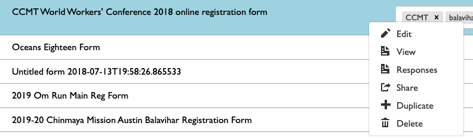
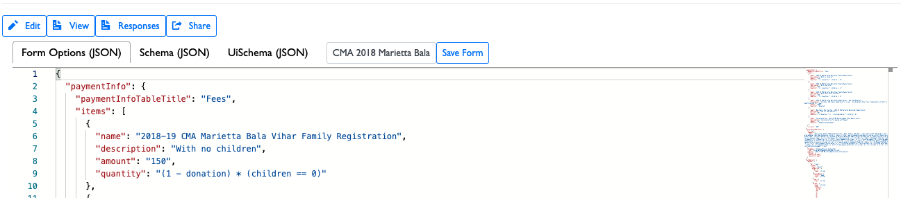
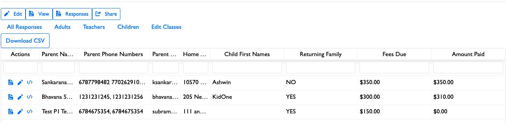
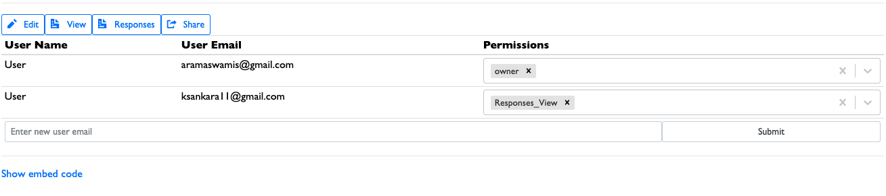
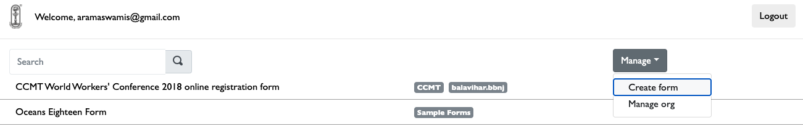

# Form management

## Form menu

Right-clicking on a form on the home page will show a drop-down menu with possible options to do on the form.

Here are the potential options:

- **Edit:** Allows you to edit the form schema, uiSchema, and formOptions. 
- **View:** View the actual form.
- **Responses:** View form responses. 
- **Share:** Modify sharing configuration of the form -- add / remove people or add permissions. 
- **Duplicate:** Duplicate the form.
- **Delete:** Delete the form.

## Form creation
You can click on the "Manage -> Create form" option to create a new form.

### Duplicating a form

To duplicate an existing form, you can right-click the form and click on the "Duplicate" button to duplicate the form and rename the form to the one you would like to use. This action will duplicate all the form configuration (schema, uiSchema, and formOptions), but does not copy over the form responses from the previous form.

!!! note
    Form creation / duplication is only available for users who have the "owner" on the main organization. This means that, practically, only admins can create forms. If you need to create a new form, please request your admin to create the form by emailing <a href="webmaster@chinmayamission.com">webmaster@chinmayamission.com</a>.