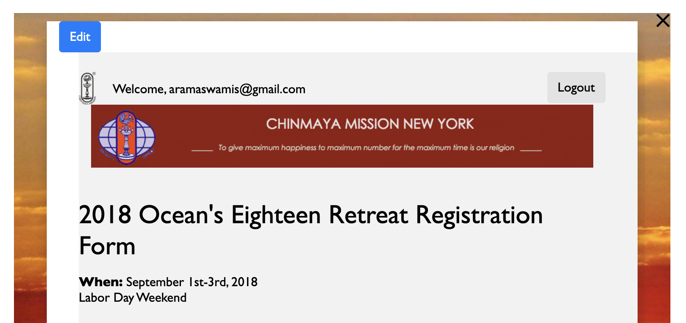
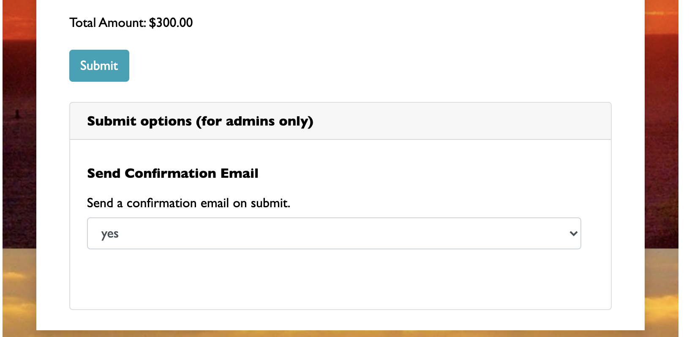
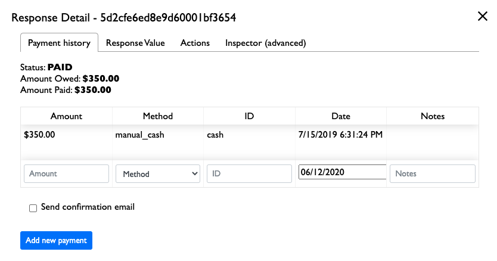
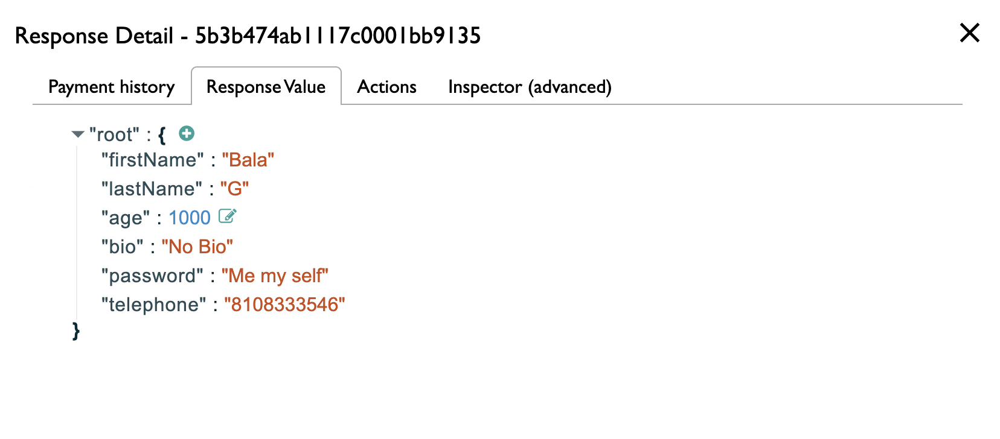
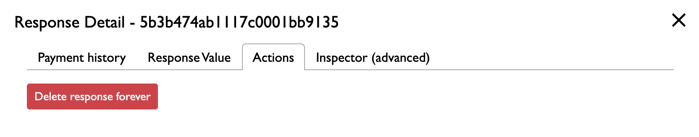
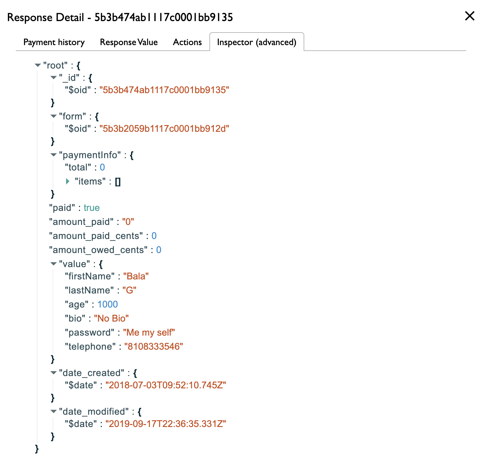

You can view responses by going to the "Response" page from a single form.

## Switching views

At the top of the response page is a list of tabs that navigate to available response views. You can click on a tab to show the data represented for that particular view.

## Exporting responsees

You can click the "Download CSV" button to download all responses in the current view as a CSV.

## Response actions

Each row has an "Actions" tab with three buttons: View, Edit, and Inspect.

### Viewing a response

Clicking on "View response" will bring you to a read-only version of the response in the form view. You can switch to editing the response by clicking on the "Edit" button at the top.

### Editing a response

Clicking on "Edit response" allows you to modify the response. Note that if you edit a response and the user has already paid, they will automatically receive a confirmation email.

At the end of the form, a "submit options" section (only available to admins with access to edit responses) lets you select whether you would like to disable this behavior or not -- if you select "no", no confirmation email will be sent. If you select "yes", a confirmation email will be sent only if the user has already paid.

### Inspecting a response

Inspecting a response allows you to perform more advanced actions on the response such as sending confirmation emails, entering in payments, or deleting the response.

#### Adding payment history

When inspecting a response, you can add manual payments to the payment history. You can add new payment amounts; this is useful if you would like to use CFF to track manual payments such as cash or check payments.

!!!note
    Make sure that each payment you enter has a unique ID.

If you select "Send confirmation email", the user will also have a confirmation email sent to them once the new payment is added. By default, a confirmation email will not be sent once a payment is added.

If you would just like to resend a confirmation email without sending a payment, you can select "Send confirmation email" and then click on the "Send email without adding a payment" button.

!!!warning
    As of now, payments cannot be deleted. If you need a payment to be deleted, consider either adding a payment with a negative amount to cancel out the previous payment, or contact <a href="mailto:webmaster@chinmayamission.com">mailto:webmaster@chinmayamission.com</a> to have the payment removed.

#### Viewing / editing the response value

Click on "Response Value" to view the raw response value. Note that this response value is in a JSON format, and can have nested objects or arrays; this is the raw format of the response as it is actually stored in our system.

You can also directly edit fields by clicking on the green "edit" icon next to each field.

#### Deleting a response

You can delete a response from the "Actions" tab. Note that this action **deletes the response forever**, so be careful if you do decide to do this.

#### Response inspector (advanced)

Going to "Inspector (advanced)" lets you inspect the entire structure of the response entry that is stored in our system; this includes not only the raw response value, but information and logs about payments and other metadata. You may not need to use this, but this might be a good place for admins to debug something if there is an issue with the form.

