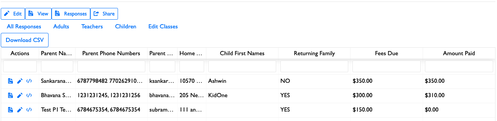

You can view responses by going to the "Response" page from a single form.

## Inspecting a response

You can click on the third icon under "actions" to inspect a response.

### Adding payment history

When inspecting a response, you can add manual payments to the payment history. You can add new payment amounts; this is useful if you would like to use CFF to track manual payments such as cash or check payments.

!!!note
    Make sure that each payment you enter has a unique ID.

If you select "Send confirmation email", the user will also have a confirmation email sent to them once the new payment is added. By default, a confirmation email will not be sent once a payment is added.

If you would just like to resend a confirmation email without sending a payment, you can select "Send confirmation email" and then click on the "Send email without adding a payment" button.

!!!warning
    As of now, payments cannot be deleted. If you need a payment to be deleted, consider either adding a payment with a negative amount to cancel out the previous payment, or contact <a href="mailto:webmaster@chinmayamission.com">mailto:webmaster@chinmayamission.com</a> to have the payment removed.