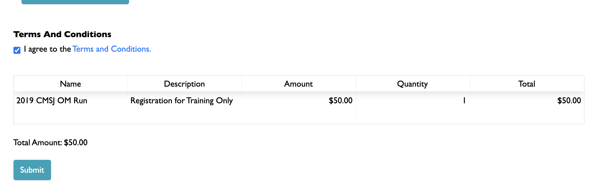
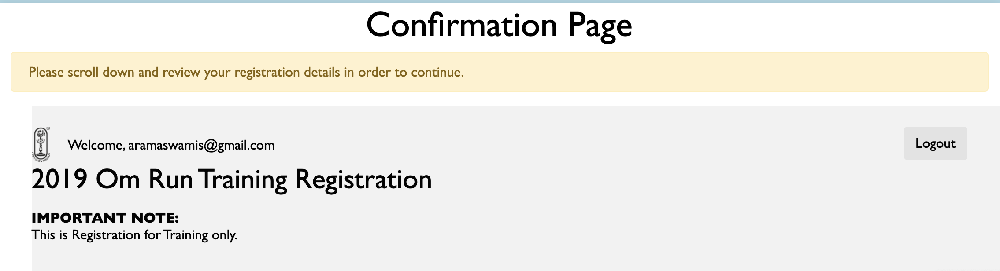
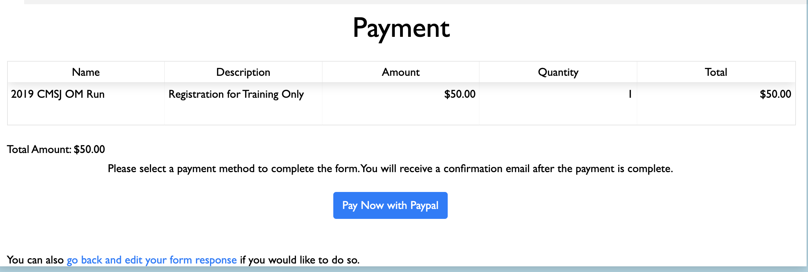
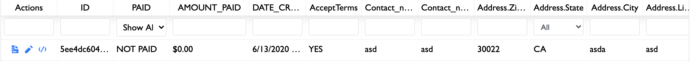
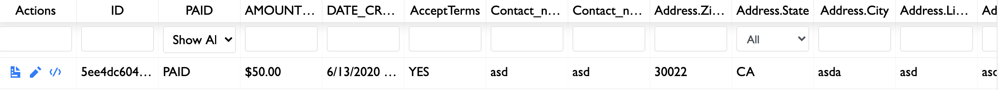

Forms can be integrated with payment methods. There are two JSON properties on formOptions that control payment:

- `formOptions.paymentInfo` - configures the actual payment calculation of the form. Based on the configuration specified in this field, you can configure how the final payment amounts are calculated based on form data, the payment currency, and more.

- `formOptions.paymentMethods` - configures the payment methods that the form is connected to. A form can be connected to a single payment method, multiple payment methods, or none.


## General payment flow

Let us take this [Om Run Training Form](https://forms.beta.chinmayamission.com/v2/forms/5b3f8b7a978a860001e276c3/) as an example.

The paymentInfo and paymentMethods are configured to be the following:

```json
{
  "paymentInfo": {
    "currency": "USD",
    "redirectUrl": "http://omrun.cmsj.org/training-thankyou/",
    "items": [
      {
        "name": "2019 CMSJ OM Run",
        "description": "Registration for Training Only",
        "amount": "50",
        "quantity": "participants"
      }
    ]
  },
  "paymentMethods": {
    "paypal_classic": {
      "zip": "$address.zip",
      "business": "payments@cmsj.org",
      "address2": "$address.line2",
      "city": "$address.city",
      "address1": "$address.line1",
      "image_url": "http://omrun.cmsj.org/wp-content/uploads/2017/01/cropped-Om-run-512px.png",
      "item_number": "Registration for Training Only",
      "sandbox": false,
      "last_name": "$contact_name.last",
      "item_name": "2018 CMSJ OM Run",
      "cmd": "_cart",
      "state": "$address.state",
      "first_name": "$contact_name.first",
      "email": "$email"
    }
  }
}
```

Let us walk through the process of filling out the form now.

1. The user fills out their information and adds a single participant.
1. At the bottom of the form, the payment table is calculated live (from the information specified in `paymentInfo`) and displayed to the user.

1. When the user clicks "Continue", they are sent to the confirmation page. At the top, the user is asked to review a read-only copy of their form:

1. At the bottom, the user is asked to continue payment with PayPal. The details of which payment methods show up here are controlled by the configuration set in `formOptions.paymentMethods`.

1. Finally, the user is redirected to PayPal, where they can complete their payment.
1. Note that the admin responses view of the user response, before the payment is complete, will show a "NOT PAID" for the response:

1. But when the payment from PayPal goes in, a confirmation email will be sent to the user, and the user's status will change to "PAID" (or "PARTIALLY PAID", if the user has not paid the entire amount owed):
