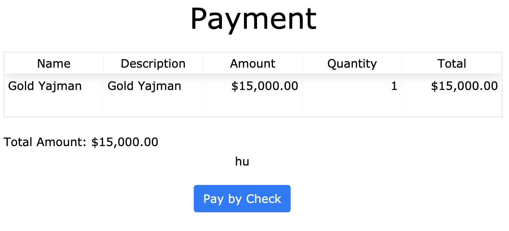
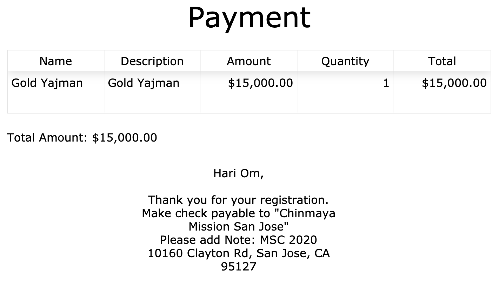

The Manual Approval payment method covers all payment methods that do not involve online payment through a payment method gateway connected to CFF. A record of each payment must be manually entered in by an admin. Examples of use cases for Manual Approval payments include:

- Cash payments
- Check payments
- Online payments that are not connected to CFF directly, such as [Zelle](https://www.zellepay.com/)

## Sample configuration

Here is a sample configuration:

```json
{
  "manual_approval": {
    "payButtonText": "Pay by Check",
    "successMessage": "Hari Om,<br><br>Thank you for your registration. Make check payable to \"Chinmaya Mission San Jose\"<br>Please add Note: MSC 2020<br>10160 Clayton Rd, San Jose, CA 95127",
    "confirmationEmailInfo": {
      "template": {
        "html": "<div style='width: 100%;background-color: #eee; margin: 10px 0px;'> <div style='width: 80%;margin: auto; box-shadow: 1px 1px 4px grey;padding: 10px 30px;background: white;'>  <div style='width: 100%; max-width: 500px; text-align: center;'> <h1 style='margin: auto;'>Chinmaya Aradhana Camp 2020 Registration Confirmation</h1></div> <br> Hari OM, <br> <br> Thank you for signing up for the 2020 MSC. <Br> <table> <tr> <th>First Name</th> <td>{{value.contactName.first}}</td> </tr> <tr> <th>Last Name</th> <td>{{value.contactName.last}}</td> </tr> </table> <br> <h2>Payment Info</h2> <table> <tr> <th>Item Name</th> <th>Description</th> <th>Amount</th> </tr> <tr> <td>{{item.name}}</td> <td>{{item.description}}</td> <td>{{item.amount | format_payment(paymentInfo.currency)}}</td> </tr> </table> <br>Amount paid: {{amount_paid | format_payment(paymentInfo.currency)}} <br><br> You can view your response <a href='{{view_link}}'>at this link</a>. Make check payable to \"Chinmaya Mission San Jose\"<br>Please add Note: MSC 2020<br>10160 Clayton Rd, San Jose, CA 95127 <br><br> You can view your response <a href='{{view_link}}'>at this link</a>.<br><br> Thanks, <br> CMSJ Team <br><br> - </div> </div>"
      },
      "cc": [],
      "subject": "MSC payment pending - please mail your check",
      "toField": "email",
      "fromName": "MSC 2020 - Chinmaya Aradhana Camp 2020",
      "bcc": "parag@cmsj.org",
      "from": "MSC2020@cmsj.org"
    }
  }
}
```

Note that the payment method is still called "manual_approval" by the system. The user, however, sees that it is a check payment because of the way `payButtonText` has been configured. At the bottom of the form, the user will see a button with this very text on it:



Finally, when the user clicks the button, a confirmation email is sent to the user using the information provided in `manual_approval.confirmationEmailInfo`. Note that this is really more of a "reminder email" or a "payment pending email" notifying the user that they need to complete payment at a later time.

The user is then shown a final screen, with the payment table at top and then a message at the bottom. This message can be customized by the `manual_approval.successMessage` attribute:



!!! note
    Typically, both the confirmation email and `successMessage` should provide the user with instructions on how to complete the payment later.

Finally, once the admin receives the payment, they should log on to the form responses admin page and enter in the payment. See [Managing Responses](../../mgmt/responses.md) for more information.

Typically, an email will then be sent letting the user know that their payment has been received (this email template will come from `formOptions.confirmationEmailInfo`, not `manual_approval.confirmationEmailInfo`).

## Multiple Manual Approval methods

If you need to show the user multiple Manual Approval methods, you can add a `manual_approval_2` key. The value for this key supports everything that could be done in the `manual_approval` key.

Your configuration may then look like this:

```json
{
  "manual_approval": {
    "payButtonText": "Pay by Cash",
    "successMessage": ...,
    "confirmationEmailInfo": ...,
  },
  "manual_approval_2": {
    "payButtonText": "Pay by Cash",
    "successMessage": ...,
    "confirmationEmailInfo": ...,
  }
}
```

See the [Overview](./overview.md) for more information about strategies for handling multiple payment methods.

!!! note
    CFF currently only supports up to two different Manual Approval payment methods.