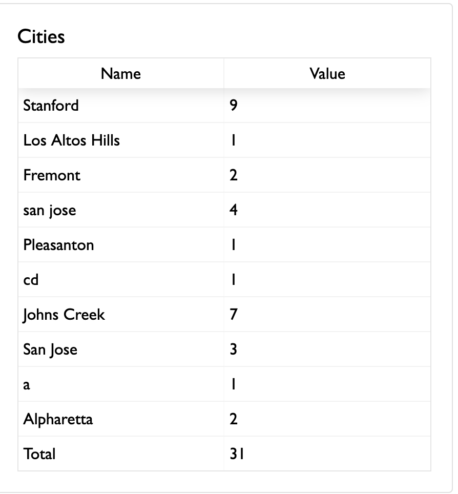

The `dataOptions.views` attribute helps control which tabs show up on the response table.

## Default view

By default, only a single tab is shown, and it contains the following fields:

* The following fields: `"ID", "PAID", "AMOUNT_PAID", "DATE_CREATED"` 
* All object fields, recursively traversed, of the actual response value


## Changing the columns

If you want to override the default view, add an entry to `formOptions.dataOptions.views` .

```json
{
  "dataOptions": {
    "views": [
      {
        "id": "all",
        "displayName": "All",
        "columns": [
          "ID",
          "DATE_LAST_MODIFIED",
          "DATE_CREATED",
          "COUNTER",
          "email"
        ]
      }
    ]
  }
}
```

Note that each item in `views` must have a unique `id` and (optionally) a `displayName` . The `columns` value describes which columns will show up in this view's table view in the "Responses" tab.

If the `views` array has multiple items in it, this will cause multiple tabs to show up in the Responses view. This is useful so that an admin can see different views of data based on what they are interested in; and this feature is needed in order to properly show nested JSON data in two-dimensional table views.

Here is an example of how the tabs rendered by multiple views look like:


### Possible columns

The possible columns include:

* Any valid accessor of the form data. This accessor is passed to lodash's `get` function, so it can be equal to a nested value such as `name.first` or `parent.age` .

* `ID` - a string value of the response id

* `PAID` - a string value describing the response's paid status. Equal to "PAID", "NOT PAID", or "PARTLY PAID".

* `DATE_CREATED` - a formatted string of the date the response was created.

* `DATE_LAST_MODIFIED` - a formatted string of the date the response was last modified.

* `AMOUNT_OWED` - a formatted string of how much money is owed. Technically, this is equal to `paymentInfo.total` formatted with `paymentInfo.currency` .

* `AMOUNT_OWED` - a formatted string of how much money has been paid. Technically, this is equal to `amount_paid` formatted with `paymentInfo.currency` .

* `admin_info` - the admin_info of the response.

* `COUNTER` - the response's counter. See [Response Counter](../formOptions/counter.md) for more information.

### Custom column display names

Each entry in the `columns` array can be specified either as a string or a column object. Specify the entry as a column object if you would like to have a custom title for the column.

The `label` key of the column denotes its display name, while the `value` key denotes the actual value accessor for that column. For example:

``` json
{
  "columns": [
    "ID",
    "DATE_LAST_MODIFIED",
    "DATE_CREATED",
    { "label": "Family ID", "value": "COUNTER" },
    "email"
  ]
}
```

The above example creates a column whose display name is "Family ID", but whose value will actually be equal to the `COUNTER` field of the response.

### Unwinding data

Unwinding data allows you to take an array field from each response and display each item in the array field as a separate row. This is especially important for cases such as the following:

* Each response contains a list of participants for a walkathon, and you want a view with one row per participant
* Each response represents a Balavihar registration for an entire family, and you want a view with a list of all adults and a view with a list of all children

To unwind data, specify the path to unwind by in the `unwindBy` property of the view. When specifying custom columns, you can use the same notation as for non-unwound views to specify column accessors. In each unwound response, however, the unwound path (that previously pointed to the array) will now point to a single array item.

For example, this view:

```json
{
  "id": "adults",
  "displayName": "Adults",
  "unwindBy": "parents",
  "columns": [
    {
      "label": "First Name",
      "value": "parents.name.first"
    },
    {
      "label": "Last Name",
      "value": "parents.name.last"
    },
    {
      "label": "Gender",
      "value": "parents.gender"
    },
    {
      "label": "Mobile Phone",
      "value": "parents.phone"
    },
    {
      "label": "Home Phone",
      "value": "home_phone"
    },
    {
      "label": "Email",
      "value": "parents.email"
    }
  ]
}
```

would properly display information for form responses that are structured like this:

```json
{
  "home_phone": "...",
  "parents": [
    {
      "name": {
        "first": "...",
        "last": "..."
      },
      "gender" "...",
      "email": "..."
    },
    {
      "name": {
        "first": "...",
        "last": "..."
      },
      "gender" "...",
      "email": "..."
    }
  ]
}
```

### Column calculations

The columns object also supports a basic level of calculations. This is used if you want a column to show more than just the value of a single field, but rather a custom calculation of the existing data.

#### Calculate length

When the `calculateLength` parameter is set to true, the header object will show the length of the value in the `value` parameter (whether it is a string or an array). For example, to show the number of participants in a response (if participants is an array of objects), use the following header object:

``` json
{
  "label": "Number of participants",
  "value": "participants",
  "calculateLength": true
}
```

#### Payment expressions

To show the value of a payment expression, set the `queryType` to `expr` and specify the expression value in `queryValue` . For example, this could be useful for showing the amount a user has paid for a particular item by doing a price calculation.

``` json
{
  "label": "Amount paid for registration",
  "queryType": "expr",
  "queryValue": "10 * (age < 18) + 15 * (age >= 18)"
}
```

#### Aggregate specific items from paymentInfo

To add up matching values in `paymentInfo` . set the `queryType` to `paymentInfoItemPaidSum` and specify the names of payment info items in `queryValue` . For example, this could be useful for showing the amount a user has paid for multiple items (such as item 1 + item 2 + discount).

``` json
{
  "label": "Amount paid for registration",
  "queryType": "paymentInfoItemPaidSum",
  "queryValue": {
    "names": [
      "Main",
      "Discount"
    ]
  }
}
```

This would match items in `paymentInfo` with `name` equal to "Main" or "Discount" and sum these values. For example, it would be equal to 49.5 for the following value of paymentInfo:

``` json
[
  {"name": "Main", "amount": 50, "quantity": 1, "total": 50},
  {"name": "Sub", "amount": 10, "quantity": 1, "total": 10},
  {"name": "Discount", "amount": -0.5, "quantity": 1, "total": -0.5}
]
```

Note that using `paymentInfoItemPaidSum` will also cross-check with amount paid. If a payment is partly paid, then it will reduce the final value accordingly. For example, if the initial sum of paymentInfoItems is equal to 49.5, but if the user has only paid 1/3 of the total amount owed (such as through an installment), the final value will be equal to 49.5 / 3 = 16.5.

If you want to filter only payments in a particular date range, specify both `startDate` and `endDate` in queryValue. Both should be in UTC. This will decrease the amounts shown proportionally as well.

``` json
{
  "label": "Amount paid for registration",
  "queryType": "paymentInfoItemPaidSum",
  "queryValue": {
    "names": [
      "Main",
      "Discount"
    ],
    "startDate": "2019-01-01T08:00:01.000Z",
    "endDate": "2020-01-01T08:00:00.000Z"
  }
}
```

#### Custom MongoDB aggregation query

To run a custom mongodb aggregate query, set `queryType` to `aggregate` as in the below example. The "n" key of the result will end up showing in the column:

``` json
{
  "label": "Age Group",
  "queryType": "aggregate",
  "queryValue": [
    {
      "$project": {
        "n": {
          "$switch": {
            "branches": [
              {"case": {"$lt": ["$age", 18]}, "then": "Child" },
              {"case": {"$lt": ["$age", 29]}, "then": "CHYK" },
              {"case": {"$lt": ["$age", 41]}, "then": "Setukari" }
            ],
            "default": "Adult"
          }
        }
      }
    }
  ]
}
```

!!! note
    Note that this aggregation will only be applied to a single response. If you want to aggregate multiple responses to get overall statistics, see [Adding a summary view](#Adding a summary view).

## Adding a summary view

You can add a summary view which runs aggregate queries in MongoDB and then shows the results of those queries in the responses table view. To do so, add an object in `dataOptions.views` with `type` equal to `stats`. Here is an example:

``` json
"views": [{
  "id": "summary",
  "displayName": "Summary",
  "type": "stats",
  "stats": [
    {
      "type": "single",
      "title": "Total number of Yajman families",
      "queryType": "aggregate",
      "queryValue": [
        {"$match": {"value.registrationType": "sponsorship"}},
        { "$group": { "_id": null, "n": { "$sum": 1 } } }
      ]
    },
    {
      "type": "single",
      "title": "Total money collected",
      "queryType": "aggregate",
      "queryValue": [{ "$group": { "_id": null, "n": { "$sum": "$amount_paid" } } } ]
    }
  ]
}]
```

The above configuration would then create a summary view that looks like the following:


### queryType aggregate

When `queryType` is `aggregate` , the queryValue will be calculated by evaluating the first value of `n` in the result set.

This is the only supported `queryType` value as of now.

### type = "single"

When type is "single", this means that a single value will be shown. The "title" attribute will be the title, and the value will be next to it. Make sure that the aggregate result has a key called "n".

The above image shows examples of how `type = "single"` stats look like.

### type = "group"

When type is "group", this means that a table of values will be shown. The "title" attribute is the title of the table. For example, you can use the following value as an item in `stats` :

``` json
{
  "type": "group",
  "title": "Aggregate by city",
  "queryType": "aggregate",
  "queryValue": [
      { "$group": { "_id": "$value.city", "n": { "$sum": 1 } } }
  ]
}
```

The above example might render a table that looks like the following:



## Configuring access

You can provision API keys for each view in `dataOptions` in order to provide different levels of anonymous access to them. For more information, see [Response Access](../api/response-access.md).
